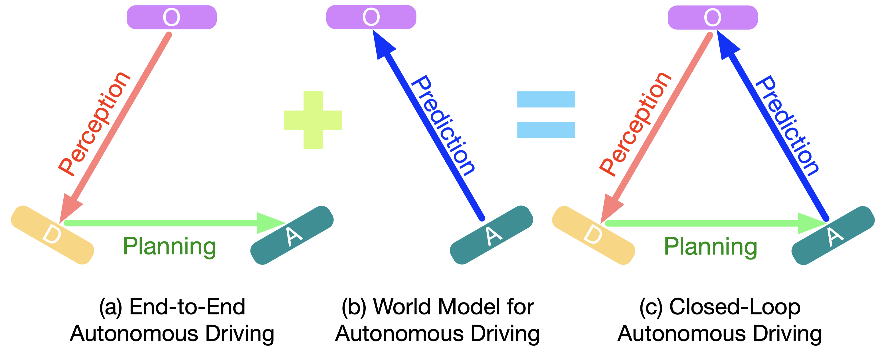
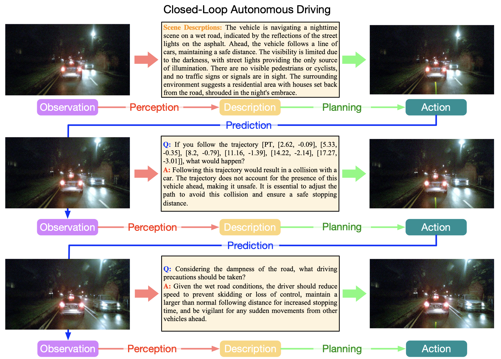

# Doe-1: Closed-Loop Autonomous Driving with Large World Model
### [Paper](https://arxiv.org/pdf/2412.08643)  | [Project Page](https://wzzheng.net/Doe)  | [Code](https://github.com/wzzheng/Doe) 


Check out our [Large Driving Model](https://github.com/wzzheng/LDM/) Series! 


> Doe-1: Closed-Loop Autonomous Driving with Large World Model

> [Wenzhao Zheng](https://wzzheng.net/)\* $\dagger$, [Zetian Xia]()\*, [Yuanhui Huang](https://huang-yh.github.io/), [Sicheng Zuo](https://github.com/zuosc19),  [Jie Zhou](https://scholar.google.com/citations?user=6a79aPwAAAAJ&hl=en&authuser=1), [Jiwen Lu](http://ivg.au.tsinghua.edu.cn/Jiwen_Lu/)

\* Equal contribution $\dagger$ Project leader

Doe-1 is the first closed-loop autonomous driving model for unified perception, prediction, and planning.

## News

- **[2024/12/13]** Model weights and evaluation code release.
- **[2024/12/13]** Paper released on [arXiv](https://arxiv.org/abs/).
- **[2024/12/13]** Demo release.

## Demo


Doe-1 is a unified model to accomplish visual-question answering, future prediction, and motion planning.

## Overview


We formulate autonomous driving as a unified next-token generation problem and use observation, description, and action tokens to represent each scene. Without additional fine-tuning, Doe-1 accomplishes various tasks by using different input prompts, including visual question-answering, controlled image generation, and end-to-end motion planning.

### Closed-Loop Autonomous Driving



We explore a new closed-loop autonomous driving paradigm which combines end-to-end model and world model to construct a closed loop.

## Visualizations

### Closed-Loop Autonomous Driving



### Action-Conditioned Video Generation


## Getting Started

### Data Preparation
1. Download nuScenes V1.0 full dataset data [HERE](https://www.nuscenes.org/download).

2. Download the annotations data_nusc from [OmniDrive](https://github.com/NVlabs/OmniDrive/releases/tag/v1.0) and unzip it.

3. Download the VQVAE weights from [HERE](https://github.com/facebookresearch/chameleon) and put them to the following directory as [HERE](https://github.com/Alpha-VLLM/Lumina-mGPT):

```
Doe/
- model/
    - lumina_mgpt/
        - ckpts/
            - chameleon/
                - tokenizer/
                    - text_tokenizer.json
                    - vqgan.yaml
                    - vqgan.ckpt
    - xllmx/
- ...
```

### Inference

<!-- We provide the following checkpoints: -->

1. Generate the conversation data for inference and set the max :
```bash
# max length: 1 for qa, 5 for planning
python dataset/gen_data.py \
--info_path path/to/infos_var.pkl \
--qa_path path/to/OmniDriveDataset \
--nusc_path path/to/nuscenes \
--save_path path/to/save/outputs \
--max_length 1
```

2. Inference with a model ckpt:
```bash
# set split and id for multi gpus
CUDA_VISIBLE_DIVICES=0 python inference/eval.py \
--anno_path path/to/val_infos.pkl \
--nusc_path path/to/nuscenes \
--save_path path/to/save/output \
--model_path path/to/model/ckpt \
--data_path path/to/generated/data.json \
--task qa
```

## Related Projects

Our code is based on the excellent work [Lumina-mGPT](https://github.com/Alpha-VLLM/Lumina-mGPT).

## Citation

If you find this project helpful, please consider citing the following paper:
```
@article{doe,
    title={Doe-1: Closed-Loop Autonomous Driving with Large World Model},
    author={Zheng, Wenzhao and Xia, Zetian and Huang, Yuanhui and Zuo, Sicheng and Zhou, Jie and Lu, Jiwen},
    journal={arXiv preprint arXiv:},
    year={2024}
}
```
